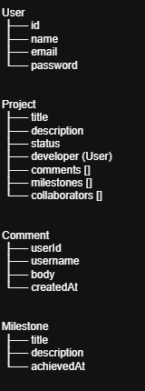
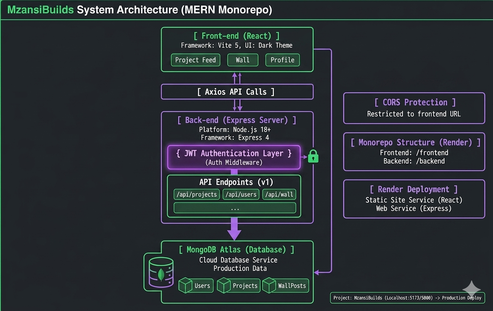
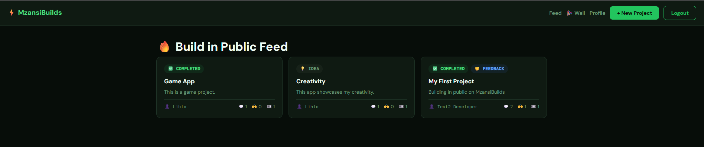
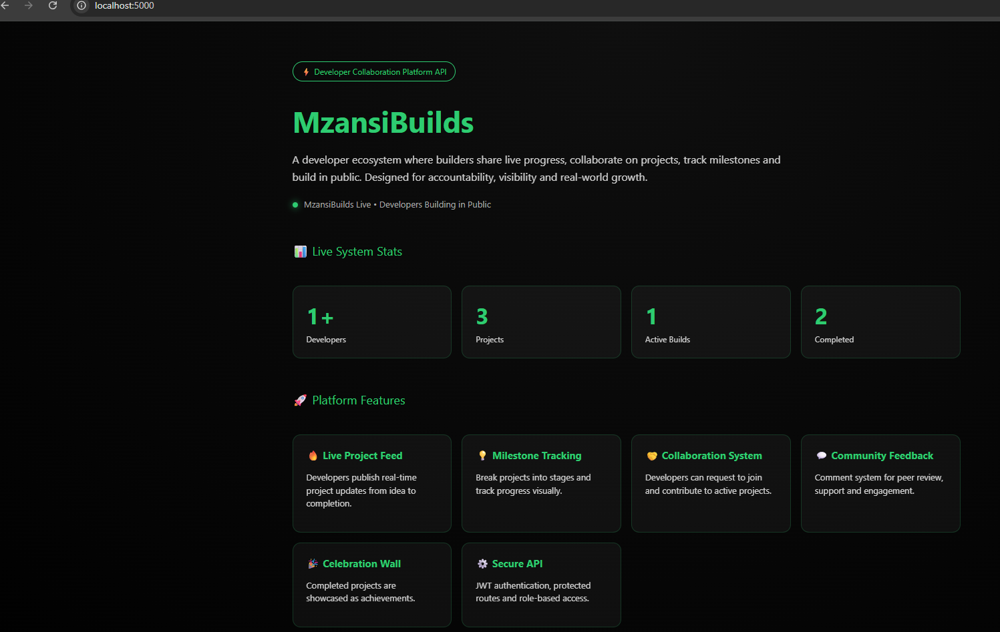

# 🚀 MzansiBuilds

A developer collaboration platform where builders share live progress, track milestones and collaborate on real-world projects.

---

## 🌐 Features

- 🔥 Live Project Feed (Build in Public updates)
- 💡 Milestone Tracking system
- 🤝 Collaboration requests between developers
- 💬 Community comments & feedback
- 🎉 Celebration Wall for completed projects
- 🔐 Secure JWT authentication system

---

## 🌍 Live Demo

🚀 Frontend (Netlify)

https://mzansibuildsapp.netlify.app

⚙️ Backend (Render API)

https://mzansibuildsapp.onrender.com

---

## 🧱 Tech Stack

**Frontend:**
- React (Vite)
- Axios
- React Router

**Backend:**
- Node.js
- Express.js
- MongoDB (Mongoose)
- JWT Authentication

---

## 🔐 Secure By Design

- JWT authentication for protected routes
- Password hashing using bcrypt
- Role-based authorization (project ownership validation)
- Input validation on backend controllers
- CORS protection
- Prevention of unauthorized actions

---

## 📊 Project Profiling

- UML design used before development
- MVC backend architecture
- RESTful API design
- Modular frontend structure

UML diagram and architecture diagram available  in `/docs`
📁 Location: `/uml.png`

📁 Location: `/architecture.png`

---

## 🔁 Code Version Control

- Git used for all development
- Feature-based commits
- Backend & frontend separation
- Prepared for CI/CD pipelines

---

## 📦 Setup Instructions

### Backend
npm install
npm run dev

### Frontend
npm install
npm run dev

---

## 🎯 Status

✔ MVP Completed  
✔ Core Features Implemented  
✔ Testing Setup Complete  
✔ Ready for Deployment

## 🖼️ Application Screenshots

### 🎨 Frontend (User Interface)

Below is the main user interface of MzansiBuilds showcasing the live project feed, collaboration features and community engagement.

📁 Location: `/docs/frontend-ui.png`

---

### ⚙️ Backend (API / Server Response)

Below is a snapshot of the backend API showing successful responses from key endpoints such as projects and users.

📁 Location: `/docs/backend-api.png`

---

### 📬 API Testing (Postman)

All endpoints were tested using Postman to validate backend functionality.

📁 Location: `/docs/postman/`

- Authentication endpoints tested (login/signup)
- Project CRUD operations tested
- Collaboration and comments tested

---

## 🧠 Challenges, Solutions & Learnings

### 🚧 Challenges Faced
- 🔌 Backend deployment delays due to Render cold starts on the free tier
- 🌐 Frontend initially not connecting to backend due to incorrect API base URL
- 🔐 JWT authentication issues where some protected routes were inaccessible
- 🔄 CORS errors when connecting Netlify frontend to Render backend

### 🛠️ Solutions & Workarounds
- ✅ Updated Axios baseURL to production backend:
https://mzansibuildsapp.onrender.com/api
- ✅ Implemented Axios interceptor to automatically attach JWT token from localStorage
- ✅ Configured backend CORS to allow requests from the deployed frontend domain
- ✅ Verified API route consistency between frontend and backend
- ✅ Used Postman extensively to test endpoints before frontend integration

---

## 📚 What I Learned
- 🚀 How to deploy and connect a full MERN stack application
- 🌍 How frontend and backend communicate in production environments
- 🔐 Practical implementation of JWT authentication in real applications
- 🧱 Debugging real-world API and deployment issues
- 🔄 Importance of environment configuration (local vs production)
- ⚙️ How to use Postman effectively for backend testing and validation

---

## 🚀 Future Improvements

### 🔔 Notifications System
- 📩 Real-time notifications for collaboration requests
- 🔔 Alerts for new comments on user projects
- 🎉 Celebration notifications when projects are marked as completed
- 📱 Optional email notifications for important updates

### 🌐 Platform Improvements
- 🔎 Advanced search and filtering for projects and developers
- 🧑‍🤝‍🧑 User profile enhancements (skills, badges, activity history)

### 📈 Scalability & Performance
- ☁️ Move backend to scalable cloud architecture (Docker + CI/CD pipeline (GitHub Actions))
- 🗄️ Database optimization with indexing for faster queries
- 🚀 Implement caching (Redis) for frequently accessed data
- 🔐 Strengthen security by running tests before deploy

---

## 📈 Project Impact

### 🌍 Real-World Real-World Value
- 💡 Encourages a “build in public” culture among developers  
- 🤝 Helps developers connect and collaborate beyond their immediate network
- 📊 Promotes accountability through visible progress and milestone tracking  

### 🧠 Technical Growth

- ⚙️ Strengthened understanding of frontend-backend integration  
- 🔄 Gained experience debugging real deployment and CORS issues  
- 🧱 Applied MVC architecture in a production-style backend  
- 🔗 Learned how to manage state, API calls and authentication in React 